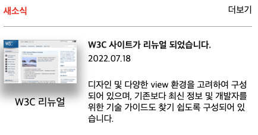

# 관련 사이트 목록 Transition 활용하여 동작하기
실습을 위한 과제로, mission-4 라는 폴더 안에 grid.html, grid.css파일을 만든다.

## HTML 마크업의 순서(head 제외)

1. section
- 이번 과제 전체를 section으로 묶는다.

2. image
- grid 작업을 앞서 div로 영역을 묶고, 이미지는 figure와 부연설명으로 figcaption를 작성한다.

## CSS마크업

1. section
- section에 class로 "news"로 생성한 뒤 가장 바깥 박스의 레이어를 꾸민다.

2. title
- h2와 더보기 링크를 display 속성을 flex로 주고, justify-content는 space-between 속성으로 준다.

3. main
- display를 grid로 주고, grid-row는 8, grid-column는 12개로 나누고 gap을 8로 준다.
- 하위 항목을 크게 세 부분(사진 / 오른쪽 상단 제목과 날짜 / 아래 설명문)으로 나누어 배치한다.

4. image
- figure와 부연설명으로 figcaption를 작성한다.

## 스크린샷

